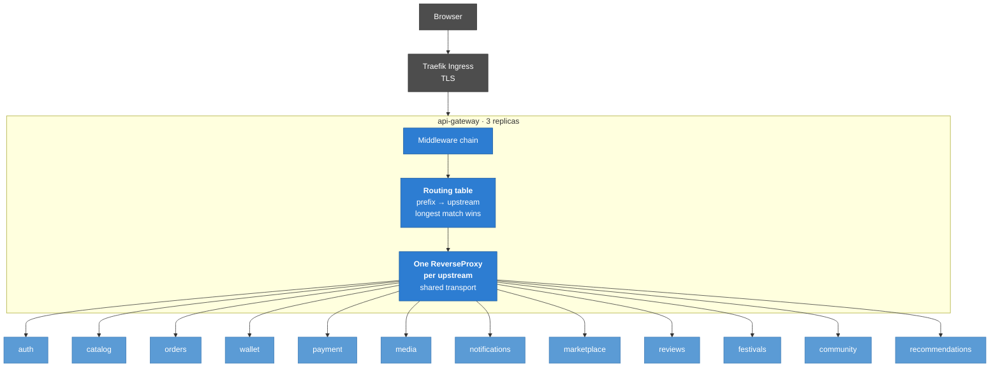

# api-gateway

Arcadia's single public entry point. One origin in front of eleven services.

```
                        ┌──────────────────────────────┐
  browser ──── :8090 ───▶│  api-gateway                 │
                        │  correlation → log → CORS    │
                        │  → rate limit → token check  │
                        └───────────┬──────────────────┘
                                    │  (internal network only)
    ┌───────────────┬───────────────┼───────────────┬───────────────┐
    ▼               ▼               ▼               ▼               ▼
 auth-profile    catalog         order           wallet          payment
   :8085          :8082          :8083            :8080           :8081
                                    │
      media :8084 · notification :8086 · marketplace :8087
      review :8088 · festival :8089 · community :8091
```

## What it does

| | |
|---|---|
| **Routing** | Strips a prefix and forwards to the service that owns it. |
| **Correlation** | Stamps a UUIDv7 on every request and returns it, so one id follows a call through eleven services' logs. |
| **CORS** | An allow-list, so the browser can talk to one origin instead of eleven. |
| **Rate limiting** | A per-address token bucket, so one client cannot exhaust the platform. |
| **Token check** | Rejects a *malformed* token at the edge, before it costs a service a database round-trip. |

## What it deliberately does not do

**Authorisation.** It does not decide who may do what. Each service owns the role
rules for its own endpoints, and a per-route role table here would be a second
copy of those rules — a second list to keep in step with the first. This platform
has already lost a notification exactly that way, when a translator existed and
its router registration did not. One list, owned by the service that enforces it.

**Require a token.** It verifies a bearer token *if one is present* and passes its
absence straight through. The alternative — a list of public routes — is the same
drift problem: add a public endpoint to catalog, forget the gateway's list, and
the endpoint is unreachable in a way that looks like a bug in catalog. The
services already reject unauthenticated calls to their protected endpoints; this
is a cheap first filter in front of that, not a replacement for it.

So: a request with no token reaches the service. A request with a *broken* token
never does.

## Architecture



One `ReverseProxy` per upstream rather than one instance with a switching director: the
per-upstream error handler is what turns a dead service into a 503 that *names the service*,
and a shared director would lose that. They share a transport, so connection pooling is
platform-wide rather than per-service.

## Use cases

| # | Use case | Notes |
|---|---|---|
| 1 | Route a request to the service that owns its prefix | Longest prefix wins; the prefix is stripped before forwarding |
| 2 | Mint or propagate a correlation id | One id per request, echoed to the caller and forwarded to the service |
| 3 | Answer CORS preflights | An allow-list, never `*` |
| 4 | Rate-limit a client | Before token verification, so garbage costs a map lookup |
| 5 | Reject a malformed or expired token | Verifies **if present**; absence passes through untouched |
| 6 | Report an unreachable upstream | 503 naming the service, not a bare 502 |
| 7 | Rewrite a redirect back through itself | So no internal hostname ever reaches a browser |
| 8 | Proxy a WebSocket upgrade | The presence socket needs it |
| 9 | List its own routes | `GET /` — the routing table, for diagnosis |
| 10 | Report health | `/livez`, `/readyz`, `/metrics` |

## How it talks to the rest of the platform

| Direction | Peer | Why |
|---|---|---|
| Called by | the storefront and any API client | The single public origin |
| Calls out | all twelve prefixed services | Plain HTTP inside the cluster |
| Publishes / consumes | *nothing* | It has no database and no broker connection. Losing it costs availability, never data |

A service missing from its configuration is a **startup error**, not a silently absent
route: a gateway that starts with eleven of twelve upstreams answers 404 for a twelfth of
the platform, and does so looking perfectly healthy.

## Infrastructure

| Concern | Choice |
|---|---|
| Language | Go 1.24, `net/http` only |
| State | None — no database, no cache, no broker |
| Image | `scratch`, ~9 MB, no shell |
| Health | The binary answers its own check — there is no `curl` in the image |
| Port | 8090 |
| Deployment | **3 replicas**, HPA to 10 at 70% CPU |

Three replicas is the floor because this is the single entry point: one pod restarting must
not be an outage.

## Routes

The prefix each service is reached under is fixed in
[`internal/gateway/routes.go`](internal/gateway/routes.go), not configurable. A
prefix is part of the platform's public contract and the frontend has it compiled
in, so an environment variable must not be able to change it quietly. Only the
internal addresses are configured.

| Prefix | Service |
|---|---|
| `/auth` | auth-profile-service |
| `/catalog` | catalog-service |
| `/orders` | order-service |
| `/wallet` | wallet-service |
| `/payment` | payment-service |
| `/media` | media-service |
| `/notifications` | notification-service |
| `/marketplace` | marketplace-service |
| `/reviews` | review-service |
| `/festivals` | festival-service |
| `/community` | community-service |

`GET /` answers with this table as JSON — "which prefix goes where" is the first
question anybody debugging this asks, and the alternative is reading a compose
file to find out.

### Operational routes

| | |
|---|---|
| `GET /livez` | Checks nothing on purpose. Answers whether *this process* is alive; a liveness probe that fails because a dependency is down asks an orchestrator to restart the wrong container. |
| `GET /readyz` | Probes every upstream's own `/readyz`, all **non-critical**. A gateway that reported itself unready because one of seven services was down would take the whole platform offline over a single failure. A dead upstream degrades readiness and the other six keep serving. |
| `GET /metrics` | Prometheus. Requests are labelled by **prefix**, not path — `/catalog/v1/games/{id}` as a label would mint a time series per game id. |

These are registered directly on the mux, so no upstream can claim them.

## Run it

```bash
cd ../infra && make up          # the services this sits in front of
cp .env.example .env            # then set JWT_SECRET
make run
```

`JWT_SECRET` must match what auth-profile-service signs with, and must be at
least 32 characters. There is no default: a gateway that silently verifies
against a well-known secret verifies nothing.

```bash
make test     # race detector; needs no infrastructure
make lint     # vet + staticcheck
make cover    # coverage report
make docker   # the image
make routes   # the routing table of a running gateway
```

## Errors

Every failure is an RFC 9457 problem document with the platform's `reason` code,
the same shape every other Arcadia service returns:

```json
{
  "type": "urn:arcadia:error:UNAVAILABLE",
  "title": "UNAVAILABLE",
  "status": 503,
  "detail": "wallet-service is not reachable",
  "reason": "UPSTREAM_UNAVAILABLE",
  "details": { "upstream": "wallet-service" },
  "trace_id": "019fae93-d32a-77b4-8361-48600448c255"
}
```

| `reason` | Status | Meaning |
|---|---|---|
| `NO_ROUTE` | 404 | No service is mapped to that prefix. |
| `TOKEN_INVALID` | 401 | The bearer token is malformed, expired, or not an access token. |
| `RATE_LIMITED` | 429 | The per-address budget is spent. `Retry-After` says when. |
| `ORIGIN_NOT_ALLOWED` | 403 | A preflight from an origin that is not on the allow-list. |
| `UPSTREAM_UNAVAILABLE` | 503 | The service is down. `details.upstream` names it. |
| `UPSTREAM_TIMEOUT` | 504 | The service took longer than `UPSTREAM_TIMEOUT`. |

The upstream is named in the detail deliberately: "503 Service Unavailable" with
nothing else sends whoever is on call to read eleven sets of logs.

## Middleware order

The order is the design, not an accident of assembly:


- **Correlation first**, so every line below it — including a rate-limit refusal —
  carries the same id.
- **AccessLog next**, so it times the whole thing, refusals included.
- **CORS before the limiter**, so a browser gets usable headers even on a 429.
  Without this a rate-limited page sees an opaque CORS error in the console
  instead of the 429 that explains itself, and the developer debugs the wrong
  problem.
- **RateLimit before the token check**, so flooding the gateway with garbage
  tokens costs a map lookup rather than a signature verification.
- **VerifyToken last**, closest to the proxy.

`TestARateLimitedRequestStillCarriesCORSHeaders` exists to keep the third one
true, because it is the one an innocent-looking refactor breaks.

## Why Go

The architecture document suggests Spring Cloud Gateway. This is Go instead:
`net/http/httputil.ReverseProxy` is the whole routing layer in a hundred lines,
the platform packages (`errs`, `logx`, `authn`, `health`, `metrics`, `config`)
already exist in this language and give the gateway the same error shape and log
format as the services behind it, and the result is a single static binary in a
`scratch` image — 9.2 MB with no shell in it, against a JVM's several hundred. For
a process whose only job is to copy bytes from one socket to another, startup
time and footprint are most of what matters.

The image has no shell, which is also why the binary answers its own health check
(`api-gateway -health-check`): there is no `curl` for Docker's `HEALTHCHECK` to
run. That is the trade for having nothing in the image to pivot with.
